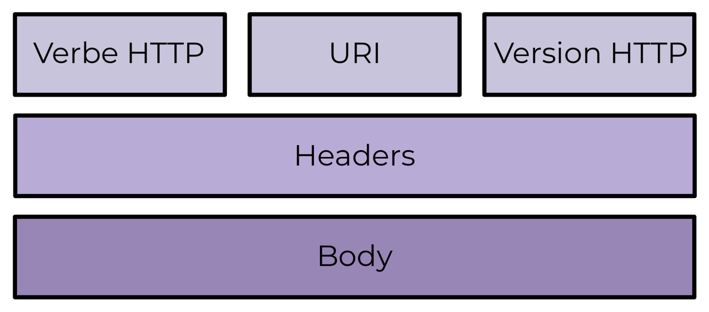

# HOW I MADE MY BOT

> The purpose here is to create a robot that can reply msgs for me in Instagram using Instagram API.

## API REST COURSES

Un client est celui qui va utiliser l’API. Cela peut être une application, un navigateur ou un logiciel. Par exemple : en tant que développeur, vous utiliserez peut-être l’API de Twitter. Comme je l’ai dit précédemment, un client peut aussi être un logiciel ou un navigateur, qu’il s’agisse de Chrome, Safari ou Firefox. Quand un navigateur se rend sur twitter.com, il formule une requête à l’API de Twitter et utilise les données de l’API afin que vous puissiez accéder aux derniers tweets.

Un serveur est un ordinateur distant capable de récupérer des données depuis la base de données, de les manipuler si besoin et de les renvoyer à l’API, comme ce gros ordinateur au milieu 

Toutes les API ne sont pas RESTful et les API REST ont des lignes directrices architecturales spécifiques.

Les avantages clés des API REST sont les suivants :
    - la séparation du client et du serveur, qui aide à scaler plus facilement les applications ;
    - le fait d’être stateless, ce qui rend les requêtes API très spécifiques et orientées vers le détail ;
    - la possibilité de mise en cache, qui permet aux clients de sauvegarder les données, et donc de ne pas devoir constamment faire des requêtes aux serveurs.

SOAP est un autre type d’API, mais est plus utilisé dans les grandes entreprises.

On doit accéder aux ressources des API avec des URl: il nous faut le path, ex: https://gameofthrones-informations.com/characters
Les données des API REST utilisent 2 types de langages : XML et JSON

Requête: 

Une f-string permet d'insérer des expressions Python directement dans une chaîne en utilisant des accolades {}. Les valeurs des expressions sont évaluées et insérées dans la chaîne lors de son exécution. Cela facilite la construction de chaînes dynamiques en incluant des variables ou des expressions directement dans la chaîne. Dans l'exemple que vous avez donné, {ID} et {MY_WEBSITE} sont des expressions qui seront remplacées par les valeurs des variables ID et MY_WEBSITE lorsque la chaîne sera formatée.