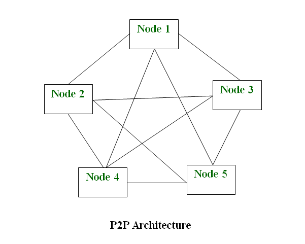

# BLOCKCHAIN TECHNOLOGY

A blockchain is public data base updated and shared across a lot of computers in a network. 

"Block" refers to data and state being stored in consecutive groups known as "blocks". If you send ETH to someone else, the transaction data needs to be added to a block to be successful.

"Chain" refers to the fact that each block cryptographically references its parent. In other words, blocks get chained together. The data in a block cannot change without changing all subsequent blocks, which would require the consensus of the entire network.

Every computer in the network must agree upon each new block and the chain as a whole. These computers are known as "nodes". Nodes ensure everyone interacting with the blockchain has the same data. To accomplish this distributed agreement, blockchains need a consensus mechanism.

## BFS

- Creation of 2 Struct of data : Block and Blockchain
- Block has every information like : time, prev_hash, hash, transaction_name, index and niveau
- Blockchain which is a Vector of Block

## P2P-Network

Instead of having a client-server network, we have nodes which is both client and server, node consume a service and provide service from and for another node.

### Use cases

- File sharing, Chat Voice, Video Call, Distributed Hash Table (key = hash(data)), File backup, Blockchain network
- Kazaa, Gnutella, BitTorrent, Skype, Cassandra, SpaceMonkey, IPFS (inter-planetary file system), blockchain network (Bitcoin, Ethereum)

### p2p topology 

### p2p network algorithm 

- Chord algorithm
- Kademlia algorithm